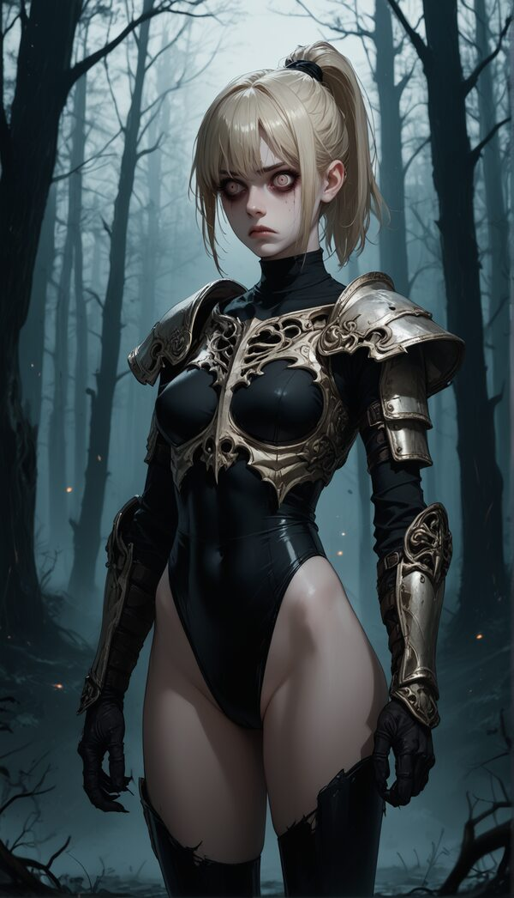
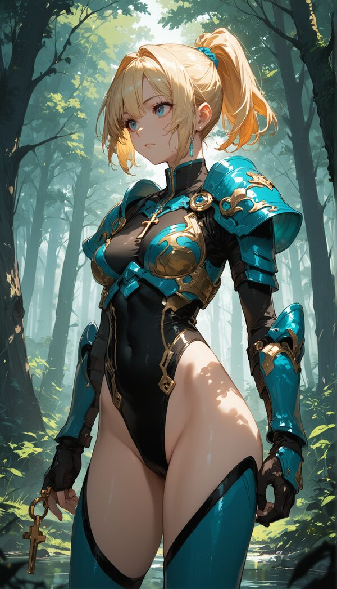

# Art

## Default

| Positive                                                                                                     |                       Negative                       |
| ------------------------------------------------------------------------------------------------------------ | :--------------------------------------------------: |
| 1girl, medium breasts,blonde short hair, high ponytail,forest,leotard, armor,score_9, score_8_up, score_7_up | text, watermark,signature, score_6, score_5, score_4 |

## Shadowgloom

| Positive                     | Negative |
| ---------------------------- | :------: |
| gothic,spooky,creepy,ominous |          |

## Ethereal Arcana

| Positive                                       | Negative |
| ---------------------------------------------- | :------: |
| elegant,brilliant,arcane,(ethereal:2),abstract |          |

## Aether Nouveau

| Positive                                       | Negative |
| ---------------------------------------------- | :------: |
| elegant,brilliant,arcane,(ethereal:2),abstract |          |

## Anime

| Positive                  |       Negative       |
| ------------------------- | :------------------: |
| key visual, vibrant,anime | realism,low contrast |

## Cute Anime

| Positive                                                      |       Negative       |
| ------------------------------------------------------------- | :------------------: |
| anime,adorable,big eyes,soft pastel colors,vobrant, childlike | realism,low contrast |

## Art Cubism

| Positive                                                                                                                              |                           Negative                            |
| ------------------------------------------------------------------------------------------------------------------------------------- | :-----------------------------------------------------------: |
| Cubist style, fragmented forms, geometric shapes, multiple perspectives, bold colors, abstract, textured brushwork, intricate details | photorealistic, smooth, low contrast, symmetrical, simplistic |

## Art Impressionism

| Positive                                                                                                                                                    |                              Negative                              |
| ----------------------------------------------------------------------------------------------------------------------------------------------------------- | :----------------------------------------------------------------: |
| Impressionist style, soft brushstrokes, light-filled, focus on natural light, vibrant colors, sense of movement, scenic landscapes, atmospheric perspective | hard edges, sharp focus, photorealistic, modern, digital, abstract |

## Art Futurism

| Positive                                                                                                                            |                     Negative                     |
| ----------------------------------------------------------------------------------------------------------------------------------- | :----------------------------------------------: |
| Futurist style, dynamic motion, metallic colors, geometric shapes, machine-inspired, high energy, speed and progress, vivid details | static, traditional, soft, low contrast, blurred |

## Art Deco

| Positive                                                                                                                         |                    Negative                    |
| -------------------------------------------------------------------------------------------------------------------------------- | :--------------------------------------------: |
| Art Deco style, bold geometry, symmetry, metallic accents, rich colors, opulence, intricate details, elegance, streamlined forms | abstract, minimalist, rough, low detail, messy |

## Minimalism

| Positive                                                                                                   |                    Negative                    |
| ---------------------------------------------------------------------------------------------------------- | :--------------------------------------------: |
| minimalist style, clean lines, open space, simplicity, muted colors, geometric forms, uncluttered, balance | detailed, intricate, ornate, busy, loud colors |

## Gothic

| Positive                                                                                                                                   |                          Negative                           |
| ------------------------------------------------------------------------------------------------------------------------------------------ | :---------------------------------------------------------: |
| Gothic style, dark and dramatic, ornate details, medieval elements, high contrast, intricate patterns, religious symbolism, cathedral-like | modern, minimal, bright colors, soft lighting, low contrast |

## Baroque

| Positive                                                                                                                                        |                      Negative                       |
| ----------------------------------------------------------------------------------------------------------------------------------------------- | :-------------------------------------------------: |
| Baroque style, grand and dramatic, rich colors, strong contrasts, ornate details, intense emotion, chiaroscuro lighting, intricate compositions | minimalist, soft colors, low detail, modern, static |

## Abstract Expressionism

| Positive                                                                                                                                       |                           Negative                           |
| ---------------------------------------------------------------------------------------------------------------------------------------------- | :----------------------------------------------------------: |
| abstract expressionist style, bold brushstrokes, emotional intensity, vivid colors, spontaneous, textured, layered paint, non-representational | realistic, symmetrical, minimal detail, photorealistic, flat |

## Romanticism

| Positive                                                                                                                                     |                        Negative                        |
| -------------------------------------------------------------------------------------------------------------------------------------------- | :----------------------------------------------------: |
| Romantic style, dramatic landscapes, emotional expression, vivid colors, heroic figures, sweeping compositions, nature-focused, lush details | abstract, modern, minimalist, industrial, low contrast |

## Renaissance

| Positive                                                                                                                                                |                    Negative                    |
| ------------------------------------------------------------------------------------------------------------------------------------------------------- | :--------------------------------------------: |
| Renaissance style, classical composition, realistic human forms, balanced lighting, soft gradients, rich colors, historical themes, intricate detailing | abstract, modern, low detail, flat, cartoonish |

## Dadaism

| Positive                                                                                                                      |                       Negative                       |
| ----------------------------------------------------------------------------------------------------------------------------- | :--------------------------------------------------: |
| Dadaist style, nonsensical, chaotic, anti-art, surreal, unexpected juxtapositions, satirical, collage-like, rebellious spirit | orderly, traditional, photorealistic, neat, balanced |

## Pointilism

| Positive                                                                                                                        |                              Negative                              |
| ------------------------------------------------------------------------------------------------------------------------------- | :----------------------------------------------------------------: |
| Pointillist style, tiny dots of color, high detail, vibrant scenes, optical mixing, painterly texture, distinct point structure | broad strokes, smooth surfaces, low detail, blurry, photorealistic |

## Realism

| Positive                                                                                                                                 |                       Negative                       |
| ---------------------------------------------------------------------------------------------------------------------------------------- | :--------------------------------------------------: |
| Realist style, accurate depiction, lifelike detail, true-to-life colors, detailed textures, sharp focus, ordinary scenes, clear lighting | abstract, surreal, exaggerated, low detail, stylized |

## Fauvism

| Positive                                                                                                                         |                          Negative                           |
| -------------------------------------------------------------------------------------------------------------------------------- | :---------------------------------------------------------: |
| Fauvist style, bold and vibrant colors, expressive brushwork, exaggerated hues, simplified forms, joyful, energetic compositions | muted colors, realistic, soft tones, detailed, low contrast |

## Op Art

| Positive                                                                                                                              |                          Negative                          |
| ------------------------------------------------------------------------------------------------------------------------------------- | :--------------------------------------------------------: |
| Op Art style, optical illusions, geometric patterns, high contrast, vibrant colors, repetitive shapes, abstract, visually mesmerizing | realism, low contrast, chaotic, organic shapes, low detail |

## Constructivism

| Positive                                                                                                                                  |                            Negative                             |
| ----------------------------------------------------------------------------------------------------------------------------------------- | :-------------------------------------------------------------: |
| Constructivist style, geometric abstraction, bold shapes, modernist aesthetic, industrial influence, limited color palette, architectural | decorative, traditional, highly detailed, organic, low contrast |

## Neo Classical

| Positive                                                                                                                                         |                        Negative                         |
| ------------------------------------------------------------------------------------------------------------------------------------------------ | :-----------------------------------------------------: |
| Neoclassical style, classical themes, restrained colors, balanced composition, heroic figures, crisp lines, idealized beauty, elegant simplicity | abstract, excessive detail, chaotic, modern, soft focus |

## Rococo

| Positive                                                                                                                                        |                      Negative                      |
| ----------------------------------------------------------------------------------------------------------------------------------------------- | :------------------------------------------------: |
| Rococo style, ornate and decorative, pastel colors, intricate details, whimsical scenes, luxurious textures, soft lighting, romantic atmosphere | minimalist, dark, simple, geometric, high contrast |

## Surrealist Pop Art

| Positive                                                                                                                                      |                           Negative                           |
| --------------------------------------------------------------------------------------------------------------------------------------------- | :----------------------------------------------------------: |
| surreal pop art style, bold colors, dreamlike elements, pop culture references, unconventional juxtapositions, playful, vibrant, eye-catching | realistic, orderly, low contrast, monochromatic, traditional |

## Bauhaus

| Positive                                                                                                                                      |                         Negative                          |
| --------------------------------------------------------------------------------------------------------------------------------------------- | :-------------------------------------------------------: |
| Bauhaus style, modernist minimalism, geometric shapes, functional aesthetic, primary colors, clean lines, balanced design, architectural feel | decorative, intricate, traditional, low contrast, chaotic |

## Lowbrow

| Positive                                                                                                                            |                       Negative                        |
| ----------------------------------------------------------------------------------------------------------------------------------- | :---------------------------------------------------: |
| lowbrow art, underground style, satirical, humorous, cartoonish, darkly whimsical, pop culture themes, vibrant colors, outsider art | refined, realistic, abstract, minimalist, traditional |

## Symbolism

| Positive                                                                                                                                 |                            Negative                            |
| ---------------------------------------------------------------------------------------------------------------------------------------- | :------------------------------------------------------------: |
| Symbolist style, dreamlike, mystical themes, symbolic imagery, dark tones, emotional depth, poetic, ethereal lighting, elaborate details | realistic, photorealistic, vibrant colors, chaotic, low detail |

## Tribal Art

| Positive                                                                                                                         |                             Negative                              |
| -------------------------------------------------------------------------------------------------------------------------------- | :---------------------------------------------------------------: |
| tribal art style, traditional patterns, earthy colors, cultural motifs, hand-carved textures, symbolic, bold shapes, rustic feel | modern, minimalist, neon colors, photorealistic, detailed realism |

## Ukiyo-e

| Positive                                                                                                                                        |                            Negative                            |
| ----------------------------------------------------------------------------------------------------------------------------------------------- | :------------------------------------------------------------: |
| Ukiyo-e style, Japanese woodblock print, bold outlines, flat colors, scenic landscapes, delicate details, traditional attire, cultural elements | photorealistic, abstract, high contrast, Western style, modern |

## Cyberpunk

| Positive                                                                                                                              |                              Negative                              |
| ------------------------------------------------------------------------------------------------------------------------------------- | :----------------------------------------------------------------: |
| cyberpunk style, futuristic dystopia, neon colors, high-tech elements, urban environment, gritty, moody, intricate technology details | traditional, rustic, soft colors, bright daylight, natural scenery |

## Brut

| Positive                                                                                                                                 |                         Negative                          |
| ---------------------------------------------------------------------------------------------------------------------------------------- | :-------------------------------------------------------: |
| Art Brut style, raw and expressive, outsider art, childlike elements, intense emotions, bold brushwork, unconventional forms, unpolished | refined, photorealistic, precise, detailed, high contrast |

## Photorealism

| Positive                                                                                                                                          |                        Negative                         |
| ------------------------------------------------------------------------------------------------------------------------------------------------- | :-----------------------------------------------------: |
| photorealistic style, lifelike detail, high resolution, sharp focus, intricate textures, true-to-life colors, highly realistic, precise rendering | abstract, blurry, impressionistic, stylized, cartoonish |

## Expressionism

| Positive                                                                                                                                  |                      Negative                      |
| ----------------------------------------------------------------------------------------------------------------------------------------- | :------------------------------------------------: |
| expressionist style, emotional intensity, distorted forms, bold brushstrokes, exaggerated colors, subjective, dramatic lighting, textured | realistic, smooth, minimal, orderly, monochromatic |

## Medieval Illuminations

| Positive                                                                                                                                         |                          Negative                          |
| ------------------------------------------------------------------------------------------------------------------------------------------------ | :--------------------------------------------------------: |
| medieval illuminated manuscript style, intricate borders, religious iconography, gold leaf accents, flat perspective, vibrant colors, decorative | realistic, abstract, photorealistic, high contrast, modern |

## Brutalism

| Positive                                                                                                                                   |                    Negative                    |
| ------------------------------------------------------------------------------------------------------------------------------------------ | :--------------------------------------------: |
| brutalist style, raw concrete textures, geometric forms, architectural focus, minimalist, monochrome, imposing structure, stark simplicity | colorful, intricate, organic, soft, decorative |

