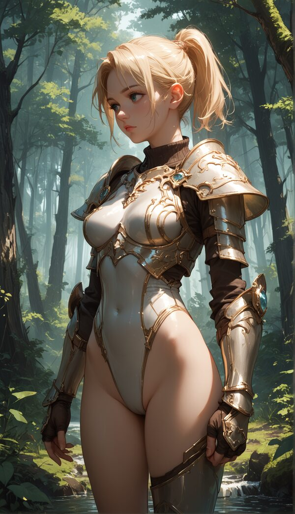
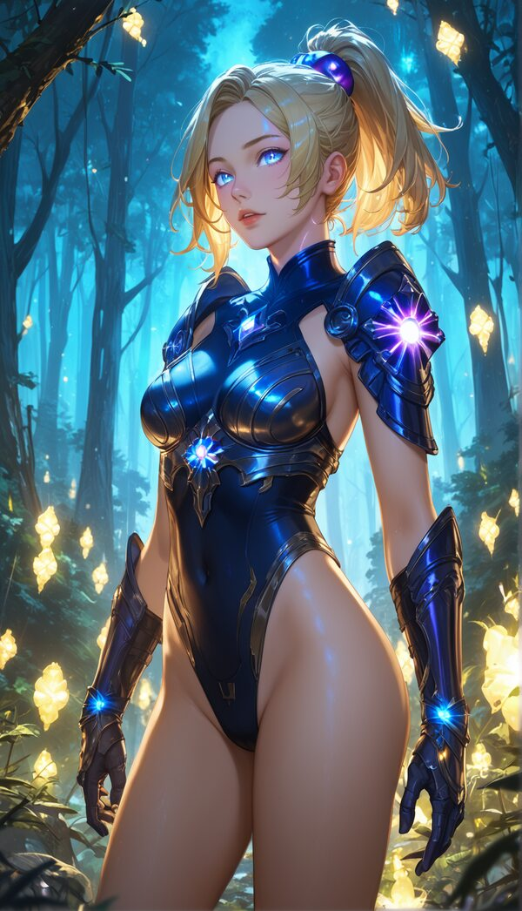
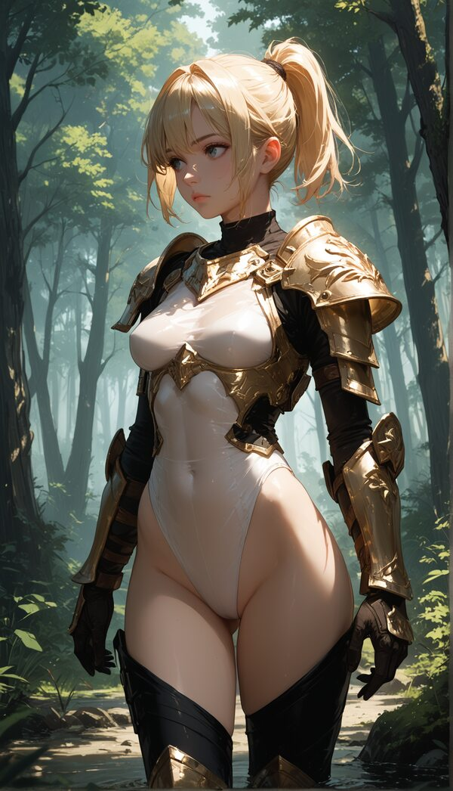
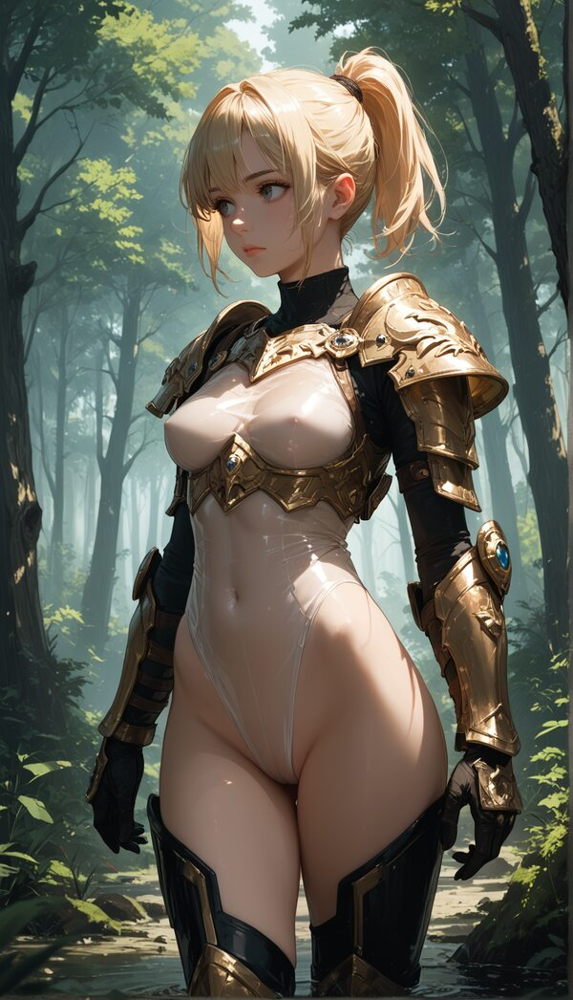
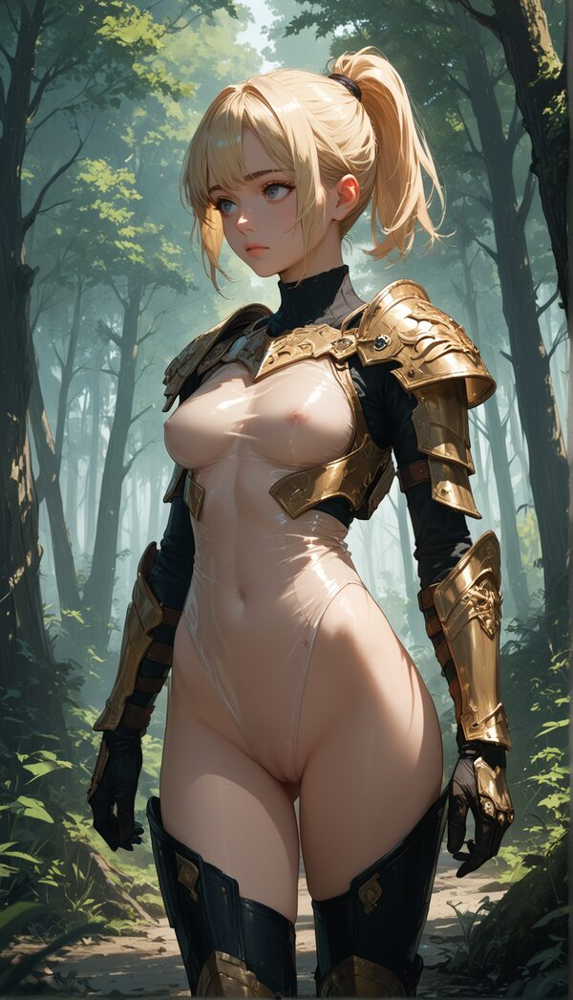

# Airy Qualities

## Default

| Positive                                                                                                     |                       Negative                       |
| ------------------------------------------------------------------------------------------------------------ | :--------------------------------------------------: |
| 1girl, medium breasts,blonde short hair, high ponytail,forest,leotard, armor,score_9, score_8_up, score_7_up | text, watermark,signature, score_6, score_5, score_4 |

## Delicate

> Suggesting fragility or finesse.

| Positive     | Negative |
| ------------ | :------: |
| (delicate:1) |          |

| Positive       | Negative |
| -------------- | :------: |
| (delicate:1.5) |          |

| Positive     | Negative |
| ------------ | :------: |
| (delicate:2) |          |

## Gossamer

> Light and thin, like a spider’s web.

| Positive     | Negative |
| ------------ | :------: |
| (gossamer:1) |          |

| Positive       | Negative |
| -------------- | :------: |
| (gossamer:1.5) |          |

| Positive     | Negative |
| ------------ | :------: |
| (gossamer:2) |          |

## Luminous

> Softly bright or radiant.

| Positive     | Negative |
| ------------ | :------: |
| (luminous:1) |          |

| Positive       | Negative |
| -------------- | :------: |
| (luminous:1.5) |          |

| Positive     | Negative |
| ------------ | :------: |
| (luminous:2) |          |

## Translucent

> Allowing light to pass through delicately.

| Positive        | Negative |
| --------------- | :------: |
| (translucent:1) |          |

| Positive          | Negative |
| ----------------- | :------: |
| (translucent:1.5) |          |

| Positive        | Negative |
| --------------- | :------: |
| (translucent:2) |          |

